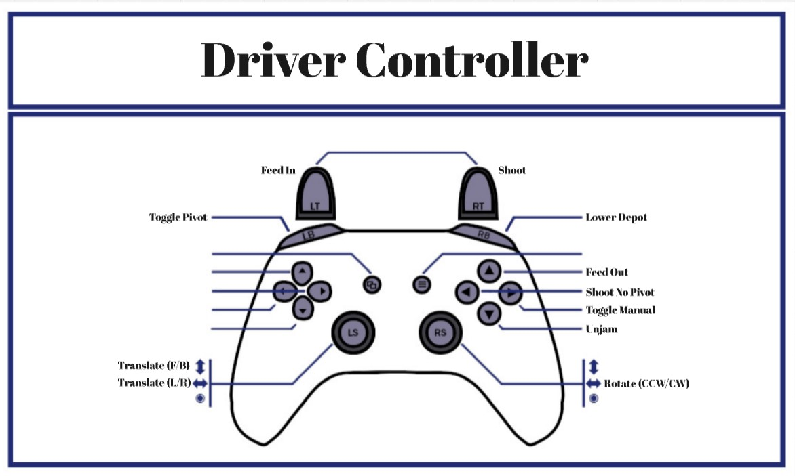

# R2026
  
Robot code for the 2026 season.

## Controls

## Controller &rarr; Keyboard (Sim)
ls y-/y+ &rarr; w/s
 ls x-/x+ &rarr; a/d
 rs x-/x+ &rarr; larr/rarr
  rt &rarr; k
 rb &rarr; l
 lt &rarr; h
 lb &rarr; j
  y &rarr; z
 b &rarr; x
 a &rarr; c
 x &rarr; v
